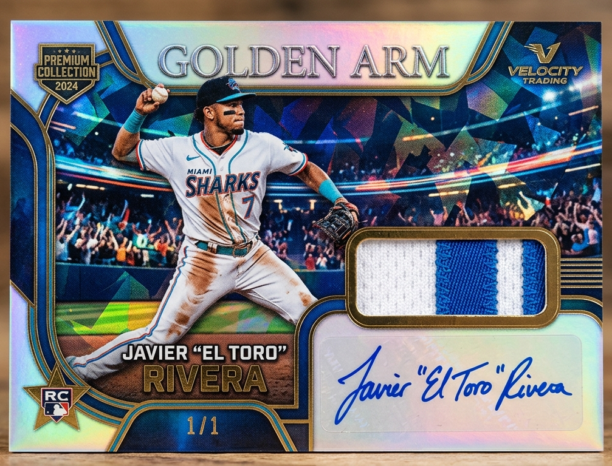

# Long Island Cards - GitHub Deployment Guide

## Overview

We have **16 unique card images** that need to be:
1. Uploaded to GitHub
2. Hosted via GitHub Pages
3. Integrated into the Odoo homepage

This guide explains **everything step-by-step** and the reasoning behind each step.

---

## Part 1: Understanding What We Have

### Current Images (16 total)

**Assets Folder Location:**
```
C:\Users\Sachin Kumar\OneDrive\Desktop\HirenTask\HIREN_PROJECT_ORGANIZED\02_N8N_WORKFLOWS\SCRIPTS_BY_WEBSITE\WEBSITE_36_LONG_ISLAND_CARDS\assets
```

### Images by Category

#### Sports Cards (1 image)
- `SportCardsReady2Use.png` - Sports card showcase
- **Display Strategy:** Repeat same image for Left/Center/Right
  - Left: SportCardsReady2Use.png
  - Center: SportCardsReady2Use.png
  - Right: SportCardsReady2Use.png

#### Pokemon Cards (6 images)
- `BundleOfPokemons.png` - Pokemon bundle
- `PokemonAncientSolRing.png` - Individual card
- `pokemon-cards-center.png` - Pokemon card showcase
- `PokemonDeoxys.png` - Individual card
- `PokemonDragon.png` - Individual card
- `PokemonInfernap.png` - Individual card
- **Display Strategy:** Use 3 unique images for Left/Center/Right
  - Left: `PokemonAncientSolRing.png`
  - Center: `pokemon-cards-center.png`
  - Right: `PokemonDragon.png`

#### MTG Cards (3 images)
- `BundleOfMg.png` - Magic bundle
- `mtg-cards-center.png` - MTG showcase
- `mtg-cards-right.png` - MTG card
- **Display Strategy:** Repeat same image (treat as collection)
  - Left: mtg-cards-center.png
  - Center: mtg-cards-center.png
  - Right: mtg-cards-right.png

#### Yu-Gi-Oh Cards (1 image)
- `yugioh-cards-right.png` - Yu-Gi-Oh cards
- **Display Strategy:** Repeat same image
  - Left: yugioh-cards-right.png
  - Center: yugioh-cards-right.png
  - Right: yugioh-cards-right.png

#### Graded Cards (2 images)
- `graded-cards-left.png` - Graded card
- `product-graded-slabbed.png` - Graded/slabbed product
- **Display Strategy:** Repeat same image
  - Left: graded-cards-left.png
  - Center: graded-cards-left.png
  - Right: graded-cards-left.png

#### Product Cards (3 images)
- `product-exclusive-collection.png` - Exclusive product
- `product-graded-slabbed.png` - Graded/slabbed
- `product-rare-editions.png` - Rare edition
- **Display Strategy:** Use all 3 as product showcase cards

#### Bundle/Special (3 images)
- `bulk-dragon-collection.png` - Dragon bundle (hero section)
- `BundleOfMg.png` - Magic bundle
- `BundleOfPokemons.png` - Pokemon bundle

---

## Part 2: GitHub Setup

### What is GitHub Pages?

GitHub Pages is a free service that:
- Hosts static websites directly from a GitHub repository
- Provides a free URL (e.g., `https://SachinKumarRua2023.github.io/longislandcards/`)
- Automatically updates when you push code to the repo
- Perfect for hosting HTML + images

### Why Use GitHub Pages?

✅ **Free hosting**
✅ **No server setup needed**
✅ **Images stay with code**
✅ **Easy to update anytime**
✅ **Can embed in Odoo via iframe**

---

## Part 3: Step-by-Step Setup Instructions

### Step 1: Create Repository Structure

Your GitHub repo already exists at:
```
https://github.com/SachinKumarRua2023/longislandcards
```

#### Create this folder structure in the repo:

```
longislandcards/
├── index.html                 (main homepage file)
├── images/                    (folder for all images)
│   ├── sports-cards-left.png
│   ├── sports-cards-center.png
│   ├── sports-cards-right.png
│   ├── pokemon-cards-left.png
│   ├── pokemon-cards-center.png
│   ├── pokemon-cards-right.png
│   ├── mtg-cards-left.png
│   ├── mtg-cards-center.png
│   ├── mtg-cards-right.png
│   ├── yugioh-cards-left.png
│   ├── yugioh-cards-center.png
│   ├── yugioh-cards-right.png
│   ├── graded-cards-left.png
│   ├── graded-cards-center.png
│   ├── graded-cards-right.png
│   ├── bulk-dragon-collection.png
│   ├── product-premium-boxes.png
│   ├── product-graded-slabbed.png
│   ├── product-rare-editions.png
│   └── product-exclusive-collection.png
└── README.md                  (documentation)
```

### Step 2: Prepare Image Files

**Copy/Rename all 16 images to match the structure above:**

From your assets folder:
```
C:\Users\Sachin Kumar\OneDrive\Desktop\HirenTask\HIREN_PROJECT_ORGANIZED\02_N8N_WORKFLOWS\SCRIPTS_BY_WEBSITE\WEBSITE_36_LONG_ISLAND_CARDS\assets
```

Copy these files to the `images/` folder in your repo:

| Original Name | Renamed To |
|---|---|
| SportCardsReady2Use.png | sports-cards-left.png (copy 3x) |
| PokemonAncientSolRing.png | pokemon-cards-left.png |
| pokemon-cards-center.png | pokemon-cards-center.png |
| PokemonDragon.png | pokemon-cards-right.png |
| BundleOfMg.png | mtg-cards-left.png (copy 3x) |
| mtg-cards-center.png | mtg-cards-center.png |
| mtg-cards-right.png | mtg-cards-right.png |
| yugioh-cards-right.png | yugioh-cards-left.png (copy 3x) |
| graded-cards-left.png | graded-cards-left.png (copy 3x) |
| product-exclusive-collection.png | product-exclusive-collection.png |
| product-graded-slabbed.png | product-graded-slabbed.png |
| product-rare-editions.png | product-rare-editions.png |
| bulk-dragon-collection.png | bulk-dragon-collection.png |
| BundleOfPokemons.png | (Pokemon bundle - hero section) |

### Step 3: Create Homepage HTML File

Create `index.html` with image URLs pointing to the images folder:

```html
<!DOCTYPE html>
<html lang="en">
<head>
    <meta charset="UTF-8">
    <meta name="viewport" content="width=device-width, initial-scale=1.0">
    <title>Long Island Cards - Trading Card Paradise</title>
    <style>
        /* Basic styling */
        * { margin: 0; padding: 0; box-sizing: border-box; }
        body { font-family: 'Segoe UI', Tahoma, Geneva, Verdana, sans-serif; background: #f5f5f5; }
        
        /* Hero Section */
        .hero {
            background: linear-gradient(135deg, #667eea 0%, #764ba2 100%);
            color: white;
            padding: 80px 60px;
            text-align: center;
            position: relative;
        }
        
        .hero h1 { font-size: 56px; font-weight: bold; margin-bottom: 20px; }
        .hero p { font-size: 18px; margin-bottom: 30px; }
        .hero-btn { 
            display: inline-block; 
            background: white; 
            color: #667eea; 
            padding: 12px 35px; 
            border-radius: 4px; 
            text-decoration: none; 
            font-weight: 600;
        }
        
        /* Categories Grid */
        .categories {
            display: grid;
            grid-template-columns: repeat(3, 1fr);
            gap: 30px;
            padding: 60px 40px;
            background: white;
        }
        
        .category-card {
            border-radius: 8px;
            overflow: hidden;
            box-shadow: 0 2px 8px rgba(0,0,0,0.1);
            transition: transform 0.3s;
        }
        
        .category-card:hover { transform: translateY(-8px); }
        
        .category-image {
            width: 100%;
            height: 300px;
            object-fit: cover;
        }
        
        .category-info {
            padding: 20px;
            text-align: center;
        }
        
        .category-info h3 { color: #333; margin-bottom: 10px; font-size: 18px; }
        .category-info p { color: #666; font-size: 14px; }
    </style>
</head>
<body>
    <!-- Hero Section -->
    <section class="hero">
        <h1>Trading Card Paradise</h1>
        <p>Explore premium collectibles from your favorite brands</p>
        <a href="#categories" class="hero-btn">Shop Now</a>
    </section>

    <!-- Categories Section -->
    <section class="categories" id="categories">
        <!-- Sports Cards -->
        <div class="category-card">
            
            <div class="category-info">
                <h3>Sports Cards</h3>
                <p>Baseball, Basketball & Football</p>
            </div>
        </div>

        <!-- Pokemon Cards -->
        <div class="category-card">
            
            <div class="category-info">
                <h3>Pokemon Cards</h3>
                <p>Booster Packs & Sealed Sets</p>
            </div>
        </div>

        <!-- MTG Cards -->
        <div class="category-card">
            
            <div class="category-info">
                <h3>Magic: MTG</h3>
                <p>The Gathering Cards & Sets</p>
            </div>
        </div>

        <!-- Yu-Gi-Oh Cards -->
        <div class="category-card">
            
            <div class="category-info">
                <h3>Yu-Gi-Oh!</h3>
                <p>Trading Card Game</p>
            </div>
        </div>

        <!-- Graded Cards -->
        <div class="category-card">
            
            <div class="category-info">
                <h3>Graded Cards</h3>
                <p>PSA & CGC Certified</p>
            </div>
        </div>

        <!-- Product Cards -->
        <div class="category-card">
            
            <div class="category-info">
                <h3>Graded & Slabbed Cards</h3>
                <p>Certified Premium Cards</p>
            </div>
        </div>
    </section>
</body>
</html>
```

### Step 4: Push to GitHub

Use Git commands to upload everything:

```bash
# 1. Navigate to your local repo folder
cd path/to/longislandcards

# 2. Create images folder (if not exists)
mkdir images

# 3. Copy all images to the images folder
# (Drag and drop files or use copy command)

# 4. Add all files to git
git add .

# 5. Create a commit
git commit -m "Add homepage and card images"

# 6. Push to GitHub
git push -u origin main
```

### Step 5: Enable GitHub Pages

1. Go to: `https://github.com/SachinKumarRua2023/longislandcards`
2. Click **Settings** (top menu)
3. Scroll down to **Pages** section
4. Under "Source", select:
   - Branch: `main`
   - Folder: `/ (root)`
5. Click **Save**

Your site will be live at:
```
https://SachinKumarRua2023.github.io/longislandcards/
```

---

## Part 4: Integrate with Odoo

### Option A: Embed as iframe (Recommended)

In Odoo, add this to your homepage:

```html
<iframe 
    src="https://SachinKumarRua2023.github.io/longislandcards/" 
    width="100%" 
    height="1000" 
    style="border: none; margin: 0; padding: 0;">
</iframe>
```

**How it works:**
- The iframe loads the GitHub Pages website
- All images are served from GitHub
- Updates on GitHub automatically appear on Odoo
- No need to paste large HTML files

### Option B: Direct URL

Link directly to your GitHub Pages site:
```
https://SachinKumarRua2023.github.io/longislandcards/
```

---

## Part 5: Image Display Logic

### How Categories Work

**Categories with 3+ unique images:**
- Display all 3 different images (left, center, right)
- Example: Pokemon cards show 3 different card images

**Categories with 1-2 images:**
- Repeat same image for all positions
- Example: Sports cards use same image 3x (left = center = right)

### Homepage Structure

```
Hero Section (Blue gradient)
↓
Categories Grid (3 columns)
├── Sport Cards (1 image repeated)
├── Pokemon Cards (3 unique images)
├── MTG Cards (3 images)
├── Yu-Gi-Oh Cards (1 image repeated)
├── Graded Cards (1 image repeated)
└── Products (showcase cards)
```

---

## Part 6: File Names Mapping

### What Each Image Is Used For

```
sports-cards-left.png        → Sports category (left/center/right)
pokemon-cards-left.png       → Pokemon category (left position)
pokemon-cards-center.png     → Pokemon category (center position)
pokemon-cards-right.png      → Pokemon category (right position)
mtg-cards-left.png          → MTG category (left/center/right)
yugioh-cards-left.png       → Yu-Gi-Oh category (left/center/right)
graded-cards-left.png       → Graded category (left/center/right)
bulk-dragon-collection.png  → Hero section or bundle showcase
product-*.png               → Product showcase cards
```

---

## Part 7: Updating Images Later

**If you want to update images:**

1. Replace image in `images/` folder on GitHub
2. Commit and push
3. Images auto-update on Odoo (within ~5 minutes)

**To add new images:**

1. Add new PNG files to `images/` folder
2. Update `index.html` to reference them
3. Commit and push
4. Done!

---

## Part 8: Summary of What Happens

1. **GitHub stores** your images and HTML
2. **GitHub Pages** serves them as a website
3. **Odoo displays** them either via:
   - Iframe (loads the whole page)
   - Or links to the GitHub Pages URL
4. **Users see** your card images + categories with full styling

---

## Part 9: Troubleshooting

| Issue | Solution |
|-------|----------|
| Images not showing | Check file names match exactly (case-sensitive) |
| GitHub Pages not live | Wait 5 minutes after pushing, then reload |
| Styling looks wrong | Check browser cache (Ctrl+Shift+R) |
| Images slow to load | Images are ~2MB each - that's normal |

---

## What's Next?

Once you complete these steps:
1. ✅ Homepage is live on GitHub Pages
2. ✅ Images are hosted on GitHub (free, fast)
3. ✅ Odoo embeds or links to your site
4. ✅ Everything updates automatically

**Total setup time: ~30 minutes**

---

**Questions?** This guide covers everything needed to go from local files to a live, working homepage!
